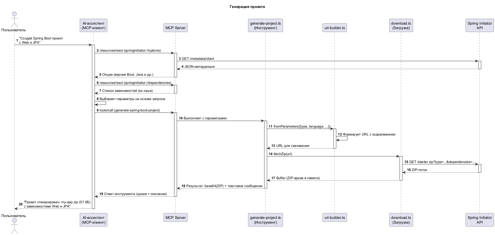
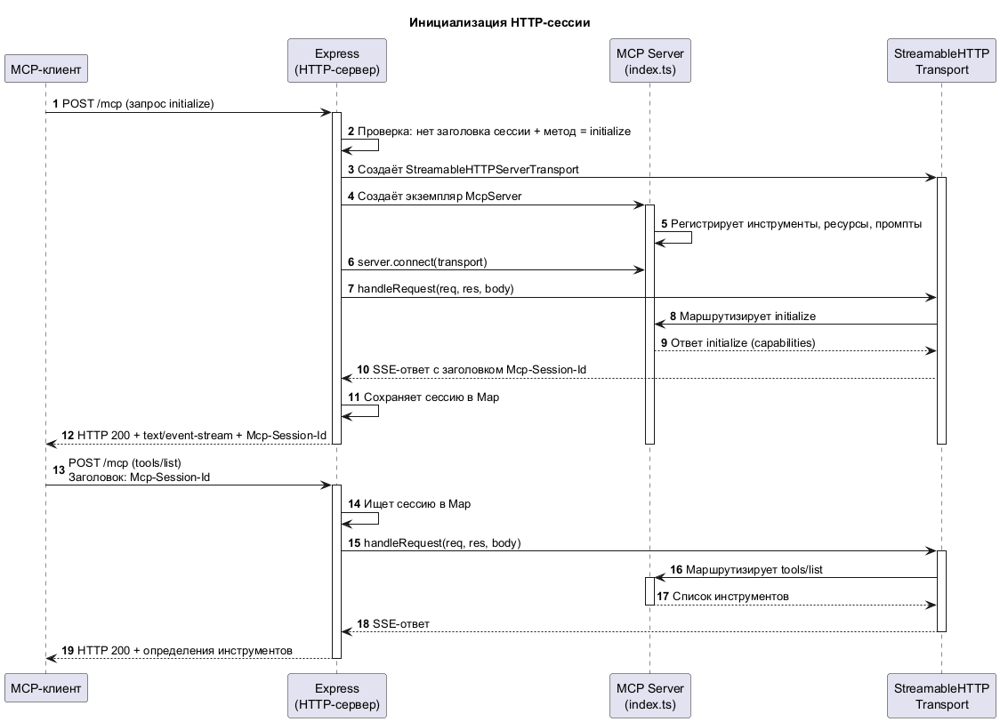

# Spring Initializr MCP Server

MCP-сервер для генерации Spring Boot проектов через AI-ассистентов (Claude, Cursor и др.).

## Какую проблему решает

Создание нового Spring Boot проекта требует ручного визита на [start.spring.io](https://start.spring.io), выбора параметров, скачивания и распаковки архива. Этот MCP-сервер позволяет AI-ассистенту сделать всё это за вас по текстовому запросу — выбрать зависимости, версию Java, систему сборки и сразу скачать готовый проект в нужную папку.

## Предварительные требования

- [Node.js](https://nodejs.org/) 22+
- npm (поставляется вместе с Node.js)

## Установка

```bash
git clone https://github.com/hpalma/springinitializr-mcp.git
cd springinitializr-mcp
```

**Linux / macOS:**

```bash
./scripts/install.sh
```

**Windows:**

```cmd
scripts\install.cmd
```

## Запуск

### Stdio (для Claude Desktop, Claude Code, Cursor)

**Linux / macOS:**

```bash
./scripts/start.sh
```

**Windows:**

```cmd
scripts\start.cmd
```

### HTTP (Streamable HTTP transport)

По умолчанию слушает на порту `8080`. Изменить: `SERVER_PORT=3000`.

**Linux / macOS:**

```bash
./scripts/start-http.sh
```

**Windows:**

```cmd
scripts\start-http.cmd
```

### Docker

Готовый образ из Docker Hub:

```bash
docker run -p 8080:8080 munirsunchalyaev/springinitializr-mcp:latest
```

Или собрать локально:

```bash
docker build -t springinitializr-mcp .
docker run -p 8080:8080 springinitializr-mcp
```

### Docker Compose (с автообновлением)

```bash
docker compose up -d
```

Включает [Watchtower](https://github.com/containrrr/watchtower) — автоматически обновляет контейнер при появлении нового образа в Docker Hub.

## Настройка в Claude Code

### Локальный сервер (stdio)

```bash
claude mcp add springinitializr node /path/to/springinitializr-mcp/dist/index.js
```

На Windows:

```cmd
claude mcp add springinitializr node C:\path\to\springinitializr-mcp\dist\index.js
```

### Удалённый сервер (HTTP)

```bash
claude mcp add springinitializr --transport http http://your-server:8080/mcp
```

Проверить, что сервер добавлен:

```bash
claude mcp list
```

## Настройка в Claude Desktop

**macOS / Linux** — `~/Library/Application Support/Claude/claude_desktop_config.json`:

```json
{
  "mcpServers": {
    "springinitializr": {
      "command": "node",
      "args": ["/path/to/springinitializr-mcp/dist/index.js"]
    }
  }
}
```

**Windows** — `%APPDATA%\Claude\claude_desktop_config.json`:

```json
{
  "mcpServers": {
    "springinitializr": {
      "command": "node",
      "args": ["C:\\path\\to\\springinitializr-mcp\\dist\\index.js"]
    }
  }
}
```

## Как это работает

### Генерация проекта

Основной сценарий: пользователь просит AI создать проект, ассистент читает доступные опции и зависимости из ресурсов, формирует параметры и вызывает инструмент. ZIP-архив возвращается клиенту в ответе.



[Подробное описание каждого шага](docs/diagrams/seq-generate-project-details.md)

### Инициализация HTTP-сессии

При работе через HTTP каждый клиент получает отдельную сессию с уникальным `Mcp-Session-Id`. Все последующие запросы маршрутизируются по этому идентификатору.



[Подробное описание каждого шага](docs/diagrams/seq-http-initialization-details.md)

Остальные диаграммы (C4, stdio) — в [docs/diagrams/](docs/diagrams/).

## Ресурсы

Сервер предоставляет MCP-ресурсы с метаданными Spring Initializr в двух форматах:

| Ресурс | Формат | Описание |
|---|---|---|
| `springinitializr://options` | text/plain | Типы проектов, языки, версии Java, packaging, версии Boot |
| `springinitializr://dependencies` | text/plain | Все зависимости по категориям |
| `springinitializr://dependencies/{category}` | text/plain | Зависимости конкретной категории |
| `springinitializr://options/json` | application/json | То же, структурированный JSON |
| `springinitializr://dependencies/json` | application/json | То же, структурированный JSON |
| `springinitializr://dependencies/{category}/json` | application/json | То же, структурированный JSON |

Текстовые ресурсы удобны для AI-ассистентов, JSON — для программного использования.

## Примеры использования

После подключения к AI-ассистенту можно давать запросы на естественном языке:

> Создай Spring Boot проект с Web, JPA и PostgreSQL

> Сгенерируй Kotlin-проект на Gradle с WebFlux и MongoDB, распакуй в ~/projects

> Создай Maven-проект с Spring Security, Actuator и Thymeleaf, Java 21

## Разработка

```bash
# Запуск без компиляции (через tsx)
npm run dev

# Запуск в HTTP-режиме без компиляции
npm run dev:http

# Запуск тестов
npm test
```

## Лицензия

[MIT](LICENSE)